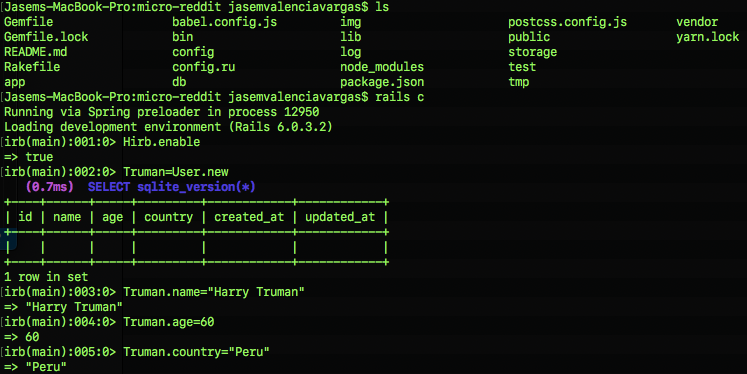
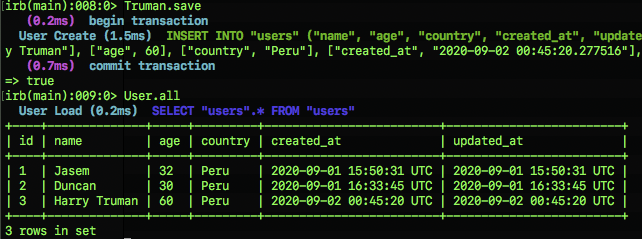
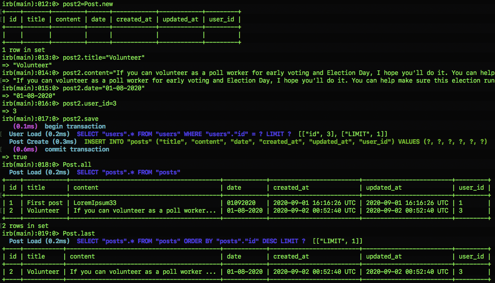
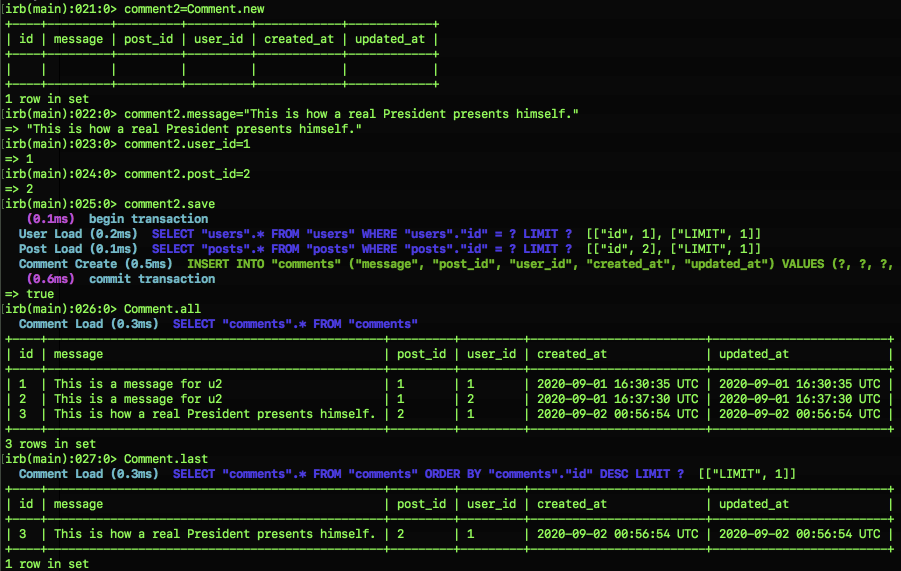

# Micro-reddit 🚀 

> In this project we practiced "Active Record" which "is the M in MVC - the model- which is the layer of the system responsible for representing business data and logic." (https://guides.rubyonrails.org/active_record_basics.html) of Ruby on Rails Framework. 

> Micro-reddit is the name of our small application quite similar to Reddit (https://www.reddit.com/). 

## Steps 
- Open your Terminal.
- Go to the project's root
- Open rails Console.
- Enable Hirb Gem.
- Create new User.
- Fill the User's attributes.
- Save user.
- Create a Post (remember to fill the id of the user)
- Save post.
- Create a Comment (remember to fill with the id of user and id of the post)
- Save comment.
- Enjoy it!

## Built With

- Ruby on Rails

## Getting Started

- Go to (https://github.com/JasemDuncan/micro-reddit) and have a look around.
- Download repo
- On terminal cd repo folder
- Terminal type (rails console)

### Prerequisites

- Browser
- Internet
- Download the code from repository (https://github.com/JasemDuncan/micro-reddit)

## Credit

- Odin project (https://www.theodinproject.com/lessons/building-with-active-record-ruby-on-rails)

## Authors

👤 **Pablo Alexis Zambrano Coral**

- Github: [@Alexoid1](https://github.com/Alexoid1)
- Twitter: [@pablo_acz](https://twitter.com/pablo_acz)
- Linkedin: [linkedin](https://www.linkedin.com/in/pablo-alexis-zambrano-coral-7a614a189/)

👤 **Jasem Duncan Valencia Vargas**

- Github: [@JasemDuncan](https://github.com/JasemDuncan)
- Twitter: [@JasemDuncan](https://twitter.com/JasemValencia)
- Linkedin: [@JasemDuncan](https://www.linkedin.com/in/jasem-duncan-valencia/)

## 🤝 Contributing

Contributions, issues and feature requests and any type of feedback to improve are welcome!

## Show your support

Give a ⭐️ if you like this project!

## 📝 License

This project has no license.
